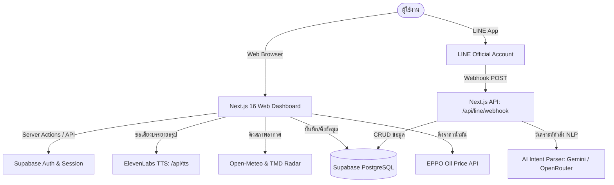
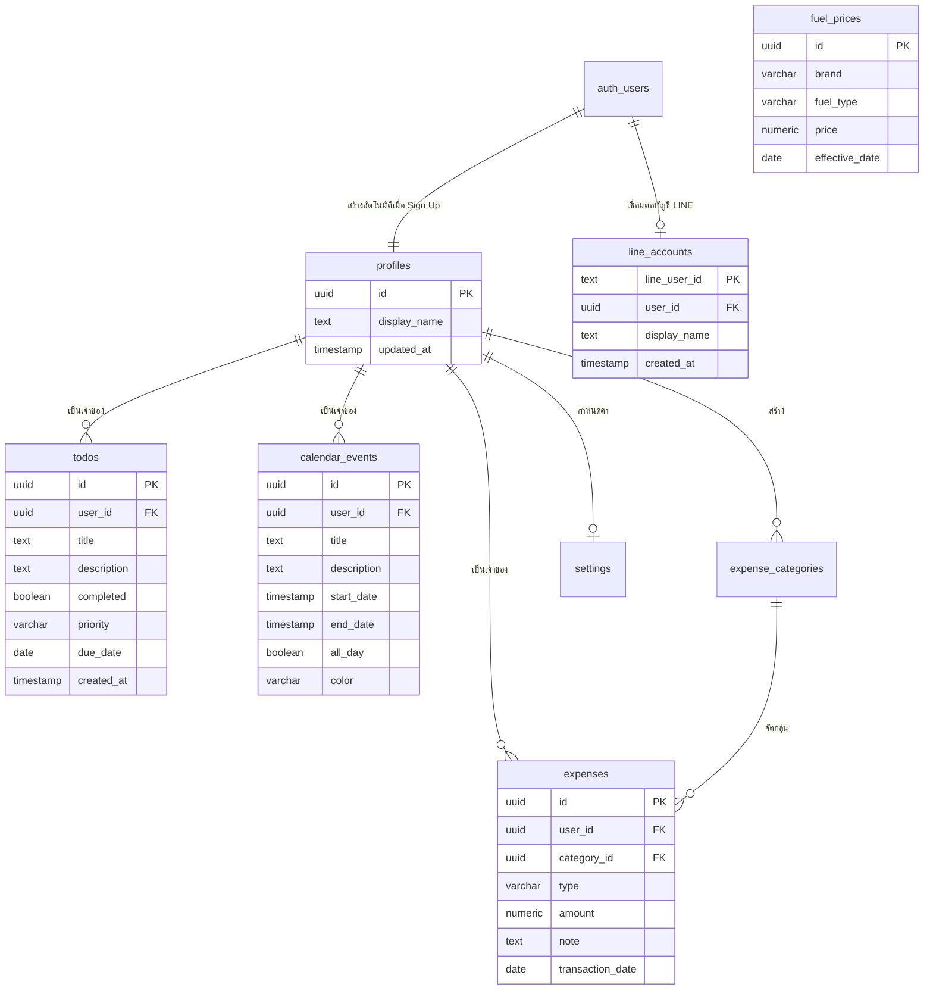

# 🌤️ Day Base — Daily Workspace & AI Assistant

[](https://nextjs.org/)
[](https://react.dev/)
[](https://www.typescriptlang.org/)
[](https://supabase.com/)
[](https://tailwindcss.com/)
[](https://developers.line.biz/)
[](https://elevenlabs.io/)

**Day Base** (หรือโปรเจกต์ **WeatherTodo / Chanthaburi Dashboard**) คือแพลตฟอร์มแดชบอร์ดส่วนบุคคลและผู้ช่วย AI อัจฉริยะ (Personal Productivity & Daily Workspace Dashboard) ที่ออกแบบมาเพื่อการบริหารจัดการชีวิตประจำวันอย่างครบวงจร ทั้งการตรวจสอบสภาพอากาศรายชั่วโมง/รายสัปดาห์, การจัดการงาน (To-Do List), ปฏิทินกิจกรรม, บันทึกรายรับ-รายจ่าย, การติดตามราคาน้ำมันขายปลีกในประเทศไทย (EPPO), พร้อมด้วย **"น้องเบส"** มาสคอต AI ที่ช่วยสรุปภาพรวมประจำวันด้วยเสียงพูด (ElevenLabs TTS) และเชื่อมต่อสั่งการผ่าน **LINE Bot** ได้แบบสองทาง

---

## 📑 สารบัญ (Table of Contents)

1. [ภาพรวมของระบบ (Overview)](#-ภาพรวมของระบบ-overview)
2. [ฟีเจอร์หลัก (Key Features)](#-ฟีเจอร์หลัก-key-features)
3. [สถาปัตยกรรมและเทคโนโลยี (Tech Stack & Architecture)](#-สถาปัตยกรรมและเทคโนโลยี-tech-stack--architecture)
4. [โครงสร้างไดเรกทอรี (Project Structure)](#-โครงสร้างไดเรกทอรี-project-structure)
5. [โครงสร้างฐานข้อมูล (Database Schema)](#-โครงสร้างฐานข้อมูล-database-schema)
6. [การตั้งค่า Environment Variables](#-การตั้งค่า-environment-variables)
7. [การติดตั้งและการเริ่มใช้งาน (Getting Started)](#-การติดตั้งและการเริ่มใช้งาน-getting-started)
8. [การทดสอบระบบ (Testing & Verification)](#-การทดสอบระบบ-testing--verification)
9. [การทำงานของ LINE Bot & AI](#-การทำงานของ-line-bot--ai)

---

## 🌟 ภาพรวมของระบบ (Overview)

Day Base รวมเครื่องมือสำคัญที่ใช้ในชีวิตประจำวันไว้ในที่เดียว โดยออกแบบอินเทอร์เฟซสไตล์ Glassmorphism ทันสมัย รองรับทั้ง Dark Mode และ Light Mode พร้อมระบบ Responsive ใช้งานได้ลื่นไหลทั้งบนคอมพิวเตอร์ แท็บเล็ต และสมาร์ตโฟน



---

## 🚀 ฟีเจอร์หลัก (Key Features)

### 1. 🤖 แดชบอร์ดภาพรวม & "น้องเบส" AI Daily Briefing
- **AI Summary Card**: สรุปสภาวะอากาศ งานที่ต้องทำ กิจกรรมในปฏิทิน และยอดเงินคงเหลือใน 3-4 ประโยคสั้นๆ พร้อมพลังบวก
- **ระบบเสียงพูด (Voice AI)**: สร้างเสียงอ่านภาษาไทยผ่าน ElevenLabs Text-to-Speech API ให้คุณฟังรายงานเช้าได้ทันที
- **สลับ AI Engine อัตโนมัติ (Fallback Strategy)**:
  1. Google Gemini (เช่น `gemini-3.5-flash-lite`)
  2. OpenRouter MiniMax M3 (Free tier fallback)
  3. Local Heuristic Synthesis Engine (ทำงานได้แม้ไม่มีเน็ตเวิร์กหรือ API Key)
- **Interactive Mascot Widget**: กล่องแชตคุยกับน้องเบสบนหน้าจอ พร้อมคำแนะนำการผูกบัญชี LINE

### 2. 🌦️ สภาพอากาศอัจฉริยะ (Weather Dashboard)
- ข้อมูลสภาพอากาศแม่นยำสูง อุณหภูมิปัจจุบัน, สภาพอากาศ, ดัชนี UV, ความชื้น, แรงลม และโอกาสเกิดฝน
- กราฟพยากรณ์รายชั่วโมง (Hourly Forecast) และพยากรณ์ล่วงหน้ารายสัปดาห์ (7-Day Forecast)
- เรดาร์ตรวจสภาพอากาศแบบสด (Weather Radar Live Loop)
- **Location Picker**: ค้นหาและเลือกจุดพยากรณ์ได้ทุกอำเภอใน จ.จันทบุรี และทุกจังหวัดทั่วไทย พร้อมบันทึกลง LocalStorage

### 3. ✅ รายการต้องทำ (To-Do & Tasks)
- เพิ่ม แก้ไข และลบงานที่ต้องทำ พร้อมกำหนดวันกำหนดส่ง (Due Date)
- ป้ายลำดับความสำคัญ (Priority: High 🔴, Medium 🟡, Low 🟢)
- ฟังก์ชันค้นหาและกรองสถานะ (ทั้งหมด, กำลังทำ, เสร็จสิ้นแล้ว)
- ระบบสถิติอัตราความสำเร็จ (Task Completion Rate)

### 4. 📅 ปฏิทินกิจกรรม (Calendar Events)
- ปฏิทินแสดงนัดหมายและกิจกรรมทั้งรายเดือนและรายวัน
- ป้ายสีแท็กกิจกรรม (Blue, Green, Purple, Red)
- สลับโหมดกิจกรรมทั้งวัน (All-day Event) หรือระบุเวลาเริ่มต้น-สิ้นสุด

### 5. 💰 ติดตามรายรับ-รายจ่าย (Finance Tracker)
- บันทึกธุรกรรมรายรับ (Income) และรายจ่าย (Expense)
- จำแนกหมวดหมู่ (Category) เช่น อาหาร, เดินทาง, ช้อปปิ้ง, ค่าบ้าน ฯลฯ
- สรุปยอดเงินคงเหลือ ยอดรวมรายรับ รายรวมรายจ่าย และประวัติย้อนหลัง

### 6. ⛽ ราคาน้ำมันขายปลีก (EPPO Fuel Prices)
- ดึงข้อมูลราคาน้ำมันขายปลีกล่าสุดจากสำนักงานนโยบายและแผนพลังงาน (สนพ. / EPPO)
- เปรียบเทียบราคาน้ำมันทุกเกรด (เบนซิน, แก๊สโซฮอล์ 95/91/E20/E85, ดีเซล) ตามแบรนด์หลัก (PTT, Bangchak, Shell, Caltex, PT, Susco)
- ระบบ Background Cron Sync (`supabase/functions/sync-fuel-prices` และ `pg_cron`) เก็บประวัติราคาลงฐานข้อมูล

### 7. 💬 สั่งงานผ่าน LINE Bot (LINE Messaging API)
- พิมพ์ข้อความภาษาธรรมชาติเพื่อสั่งการระบบผ่านแชต LINE เช่น:
  - *"เตือนซื้อยา ตอน 6 โมงเย็น"* ➡️ บันทึกเป็น To-Do อัตโนมัติ
  - *"จ่ายค่ากาแฟ 65 บาท"* ➡️ บันทึกลง Tracker รายจ่ายทันที
  - *"สรุปยอด"* / *"วันนี้มีงานอะไรบ้าง"* / *"อากาศวันนี้"* ➡️ ตอบกลับด้วย LINE Flex Message แบบการ์ดสวยงาม
- ฟังก์ชัน **ผูกบัญชี** (Account Linking) เพื่อเชื่อมโยงบัญชี LINE กับ User ในระบบ Day Base

### 8. 🔐 ระบบความปลอดภัยและการจัดการสิทธิ์ (Auth & Security)
- รองรับการล็อกอินผ่าน **Email/Password** และ **Google OAuth**
- ปกป้องข้อมูลผู้ใช้ด้วย **Supabase Row Level Security (RLS)** แยกข้อมูลของผู้ใช้แต่ละคนอย่างเด็ดขาด
- Next.js Middleware คอยดักตรวจ Session ก่อนเข้าสู่หน้า `/dashboard`

---

## 🛠️ สถาปัตยกรรมและเทคโนโลยี (Tech Stack & Architecture)

| หมวดหมู่ | เทคโนโลยีที่เลือกใช้ |
|---|---|
| **Framework** | [Next.js 16 (App Router)](https://nextjs.org/) |
| **UI Library** | [React 19](https://react.dev/), [Lucide React](https://lucide.dev/) (Icons) |
| **Language** | [TypeScript 5](https://www.typescriptlang.org/) |
| **Styling** | [Tailwind CSS v4](https://tailwindcss.com/) + Custom Design System CSS |
| **Authentication & Database** | [Supabase](https://supabase.com/) (PostgreSQL + RLS + GoTrue Auth) |
| **Database Extensions** | `pgcrypto`, `pg_cron`, `pg_net` |
| **AI / LLM Integration** | Google Gemini API (`gemini-3.5-flash-lite`), OpenRouter API (MiniMax M3) |
| **Voice & Speech** | [ElevenLabs](https://elevenlabs.io/) (Thai Voice AI Text-to-Speech) |
| **External APIs** | Open-Meteo API (Weather), EPPO Oil API (Fuel Prices), LINE Messaging API |
| **Testing** | TypeScript Test Runner (`scripts/run-tests.ts`), ESLint 9 |

---

## 📁 โครงสร้างไดเรกทอรี (Project Structure)

```text
WeatherTodo/
├── app/
│   ├── actions/                  # Next.js Server Actions (Database & Business Logic)
│   │   ├── ai-actions.ts         # ประมวลผล AI Briefing & Nong Base Mascot Chat
│   │   ├── calendar-actions.ts   # CRUD จัดการอีเวนต์ปฏิทิน
│   │   ├── fuel-actions.ts       # ดึงและ sync ราคาน้ำมันจาก EPPO
│   │   ├── line-actions.ts       # ตรวจสอบสถานะการเชื่อมต่อ LINE Account
│   │   ├── todo-actions.ts       # CRUD จัดการงาน To-Do
│   │   └── tracker-actions.ts    # CRUD รายรับ-รายจ่าย
│   ├── api/                      # Next.js Route Handlers (REST & Webhooks)
│   │   ├── cron/fuel-prices/     # Endpoint สำหรับ Cron trigger ราคาน้ำมัน
│   │   ├── fuel-prices/          # REST API ราคาน้ำมัน
│   │   ├── line/webhook/         # LINE Webhook Receiver & Signature Validator
│   │   └── tts/                  # Text-to-Speech Proxy ไปยัง ElevenLabs
│   ├── auth/callback/            # OAuth Callback Handler (Google Login)
│   ├── components/               # คอมโพเนนต์ที่ใช้ร่วมกัน
│   │   ├── GoogleAuthButton.tsx  # ปุ่มล็อกอินด้วย Google OAuth
│   │   ├── MascotLineWidget.tsx  # วิดเจ็ตมาสคอตน้องเบสแบบ Floating
│   │   └── Toast.tsx             # ระบบแจ้งเตือน Notification Toast
│   ├── dashboard/                # โมดูลหน้าแดชบอร์ดหลัก (Client Sub-tabs)
│   │   ├── ai-briefing-card.tsx  # การ์ดสรุปเช้า AI พร้อมปุ่มเล่นเสียง
│   │   ├── calendar.tsx          # แท็บปฏิทิน
│   │   ├── fuel-prices.tsx       # แท็บราคาน้ำมันขายปลีก
│   │   ├── location-picker.tsx   # ป๊อปอัปเลือกจังหวัด/อำเภอ
│   │   ├── overview.tsx          # แท็บภาพรวมแดชบอร์ด
│   │   ├── page.tsx              # ตัวควบคุมหลัก Dashboard Layout & Tab Routing
│   │   ├── todo.tsx              # แท็บรายการต้องทำ
│   │   ├── tracker.tsx           # แท็บบันทึกการเงิน
│   │   └── weather.tsx           # แท็บพยากรณ์อากาศและเรดาร์
│   ├── data/                     # Static dataset (รายชื่อจังหวัดและอำเภอ)
│   ├── login/                    # หน้าจอเข้าสู่ระบบ
│   ├── register/                 # หน้าจอบันทึกสมัครสมาชิก
│   ├── globals.css               # ดีไซน์โทเคน CSS Variables, Animation, Layout
│   ├── layout.tsx                # Root HTML Layout
│   ├── page.tsx                  # หน้าแรก Redirect ตรวจสอบสิทธิ์
│   └── providers.tsx             # React Context Providers (Auth, Theme)
├── middleware.ts                 # ตรวจสอบสิทธิ์ Supabase Session Middleware
├── public/                       # รูปภาพ โลโก้ และ Asset ไฟล์สแตติก
├── scripts/                      # สคริปต์ทดสอบและบิลด์
│   ├── analyze-bundle.js         # วิเคราะห์ขนาด Bundle
│   └── run-tests.ts              # System Route & Build Health Test Suite
├── supabase/                     # ฐานข้อมูล Supabase
│   ├── functions/                # Supabase Edge Functions (sync-fuel-prices)
│   ├── migrations/               # SQL Migration Files (LINE Bot, Cron Schedules)
│   └── relationships.sql         # SQL Schema: Tables, RLS, Indexes, Triggers
├── types/                        # TypeScript Type Definitions
│   ├── database.ts               # Database Entities (Todo, Expense, Calendar, etc.)
│   └── line.ts                   # LINE Webhook, Flex Message & AI Intent Types
└── utils/                        # โมดูลฟังก์ชันช่วยเหลือ
    ├── ai-briefing.ts            # Heuristic Local Engine สำหรับสร้าง Daily Briefing
    ├── line/                     # LINE Messaging Client, Flex Templates & NLP Intent
    ├── openrouter.ts             # OpenRouter API Integration & JSON Parser
    ├── supabase/                 # Supabase SSR Clients (Client, Server, Admin)
    └── weather-codes.ts          # ตัวแปลรหัสสภาพอากาศ WMO สู่ภาษาไทย
```

---

## 🗄️ โครงสร้างฐานข้อมูล (Database Schema)

ระบบทำงานบน **Supabase (PostgreSQL)** โดยเปิดใช้งาน Row Level Security (RLS) ในทุกตารางที่เกี่ยวข้องกับผู้ใช้:



### รายละเอียดตารางสำคัญ:
- **`profiles`**: เก็บข้อมูลผู้ใช้งานทั่วไป เชื่อมโยงกับ `auth.users` โดยมี Trigger `handle_new_user` สร้างข้อมูลให้อัตโนมัติเมื่อลงทะเบียน
- **`todos`**: รายการงานที่ต้องทำ สถานะ ความสำคัญ และวันครบกำหนด
- **`expenses`**: ข้อมูลรายรับ-รายจ่าย เชื่อมกับ `expense_categories`
- **`calendar_events`**: กำหนดการกิจกรรม แท็กสี และช่วงวันเวลา
- **`fuel_prices`**: ประวัติราคาน้ำมันขายปลีกแยกตามแบรนด์ (ซิงก์จาก EPPO อัตโนมัติ)
- **`line_accounts`**: จับคู่ `line_user_id` กับ `user_id` ใน Supabase เพื่อให้สั่งงานผ่าน LINE ได้ถูกต้องรายบุคคล

---

## ⚙️ การตั้งค่า Environment Variables

สร้างไฟล์ `.env.local` ที่ Root ของโปรเจกต์ โดยอ้างอิงจาก `.env.example`:

```env
# ==========================================
# 1. Supabase Settings
# ==========================================
NEXT_PUBLIC_SUPABASE_URL=https://your-project.supabase.co
NEXT_PUBLIC_SUPABASE_PUBLISHABLE_KEY=your-supabase-publishable-key
SUPABASE_SERVICE_ROLE_KEY=your-supabase-service-role-key

# ==========================================
# 2. AI Providers (สำหรับ AI Daily Briefing & Nong Base)
# ==========================================
GEMINI_API_KEY=your-google-gemini-api-key
OPENROUTER_API_KEY=your-openrouter-api-key

# ==========================================
# 3. LINE Messaging API (สำหรับ LINE Bot & Webhook)
# ==========================================
LINE_CHANNEL_SECRET=your-line-channel-secret
LINE_CHANNEL_ACCESS_TOKEN=your-line-channel-access-token

# ==========================================
# 4. ElevenLabs Settings (สำหรับ Voice AI / TTS)
# ==========================================
ELEVENLABS_API_KEY=your-elevenlabs-api-key
ELEVENLABS_VOICE_ID=cgSgspJ2msm6clMCkdW9
ELEVENLABS_MODEL_ID=eleven_v3
```

---

## 💻 การติดตั้งและการเริ่มใช้งาน (Getting Started)

### ความต้องการของระบบ (Prerequisites)
- [Node.js](https://nodejs.org/) เวอร์ชัน 20.x ขึ้นไป
- บัญชี [Supabase](https://supabase.com/) สำหรับจัดการ Database และ Auth
- LINE Developer Account (กรณีต้องการใช้งาน LINE Bot)

### ขั้นตอนการรันโปรเจกต์:

1. **โคลนโปรเจกต์และติดตั้ง Dependencies**:
   ```bash
   git clone https://github.com/Nack233/WeatherTodo.git
   cd WeatherTodo
   npm install
   ```

2. **ตั้งค่าฐานข้อมูลใน Supabase**:
   - เปิดแดชบอร์ดโครงการใน Supabase -> ไปที่เมนู **SQL Editor**
   - รันคำสั่ง SQL จากไฟล์ [`supabase/relationships.sql`](file:///c:/Users/User/OneDrive/เอกสาร/GitHub/WeatherTodo/supabase/relationships.sql) เพื่อสร้างตาราง Indexes และ RLS Policies
   - รันไฟล์ Migration เพิ่มเติมใน [`supabase/migrations/`](file:///c:/Users/User/OneDrive/เอกสาร/GitHub/WeatherTodo/supabase/migrations/) หากต้องการใช้งาน LINE Bot หรือ Schedule Sync ราคาน้ำมัน

3. **ตั้งค่าตัวแปรสภาพแวดล้อม**:
   - คัดลอก `.env.example` เป็น `.env.local`
   - กรอกค่า API Keys ให้ครบถ้วน

4. **เริ่มรัน Development Server**:
   ```bash
   npm run dev
   ```
   เปิดเว็บเบราว์เซอร์แล้วเข้าไปที่ `http://localhost:3000`

---

## 🧪 การทดสอบระบบ (Testing & Verification)

โปรเจกต์มีชุดทดสอบอัตโนมัติเพื่อตรวจสอบความถูกต้องของไฟล์หน้าจอ, ลอจิกการตรวจสอบ Weather Cache, การลงทะเบียน Tab, ลอจิกการสกัด JSON ของ AI, และการทำ Production Build:

```bash
npm test
```

### การตรวจสอบ Production Build โดยตรง:
```bash
npm run build
```

---

## 📲 การทำงานของ LINE Bot & AI

### 1. การเชื่อมต่อ Webhook
- URL สำหรับตั้งค่าใน LINE Developers Console:
  ```text
  https://<YOUR-DOMAIN>/api/line/webhook
  ```
- ระบบมี Signature Verification ป้องกันคำขอที่ไม่พึงประสงค์โดยอัตโนมัติ

### 2. ตัวอย่างคำสั่งที่รองรับ
- **ผูกบัญชี**: พิมพ์ `ผูกบัญชี your-email@example.com` เพื่อจับคู่ LINE กับบัญชี Day Base
- **เพิ่มงาน**: *"เตือนอ่านหนังสือ พรุ่งนี้ 9 โมง"*
- **บันทึกรายจ่าย**: *"จ่ายค่าน้ำมัน 800 บาท"* หรือ *"ซื้อข้าวกะเพรา 60 บาท"*
- **บันทึกรายรับ**: *"ได้เงินเดือน 30000 บาท"*
- **ดูงานค้าง**: *"มีงานอะไรบ้าง"* หรือ *"รายการต้องทำ"*
- **เช็กสภาพอากาศ**: *"สภาพอากาศ"* หรือ *"ฝนจะตกไหม"*
- **ถาม-ตอบทั่วไป**: แชตคุยสนทนาทั่วไปกับน้องเบสผ่าน AI Intent

---

## 📄 ใบอนุญาต (License)

โปรเจกต์นี้พัฒนาขึ้นเพื่อการใช้งานส่วนบุคคลและการศึกษา (Private Project) ลิขสิทธิ์เป็นของผู้พัฒนา
