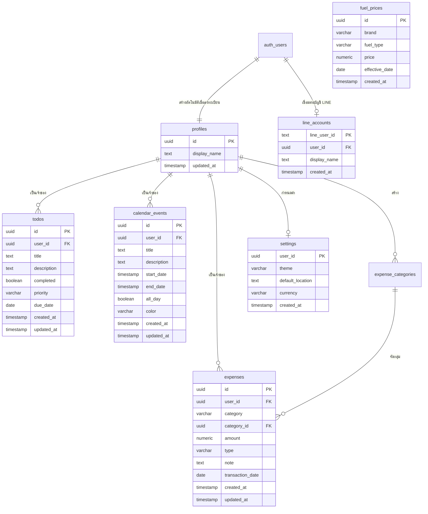

# 🌤️ Day Base — Daily Workspace & AI Assistant

[](https://nextjs.org/)
[](https://react.dev/)
[](https://www.typescriptlang.org/)
[](https://supabase.com/)
[](https://tailwindcss.com/)
[](https://developers.line.biz/)
[](https://elevenlabs.io/)

**Day Base** (`daybase-dashboard`) คือแพลตฟอร์มแดชบอร์ดส่วนบุคคลและผู้ช่วย AI อัจฉริยะ (Personal Productivity & Daily Workspace Dashboard) ที่ออกแบบมาเพื่อการบริหารจัดการชีวิตประจำวันอย่างครบวงจร ทั้งการตรวจสอบสภาพอากาศรายชั่วโมง/รายสัปดาห์, การจัดการงาน (To-Do List), ปฏิทินกิจกรรม, บันทึกรายรับ-รายจ่าย, การติดตามราคาน้ำมันขายปลีกในประเทศไทย (EPPO), พร้อมด้วย **"น้องเบส"** มาสคอต AI ที่ช่วยสรุปภาพรวมประจำวันด้วยเสียงพูด (ElevenLabs TTS) และเชื่อมต่อสั่งการผ่าน **LINE Official Account (LINE Bot)** ได้แบบสองทาง

---

## 📑 สารบัญ (Table of Contents)

1. [ภาพรวมของระบบ (Overview & Architecture)](#-ภาพรวมของระบบ-overview--architecture)
2. [ฟีเจอร์หลัก (Key Features)](#-ฟีเจอร์หลัก-key-features)
3. [สถาปัตยกรรมและเทคโนโลยี (Tech Stack & Architecture)](#-สถาปัตยกรรมและเทคโนโลยี-tech-stack--architecture)
4. [โครงสร้างไดเรกทอรี (Project Structure)](#-โครงสร้างไดเรกทอรี-project-structure)
5. [โครงสร้างฐานข้อมูลและประเภทข้อมูล (Database Schema & Types)](#-โครงสร้างฐานข้อมูลและประเภทข้อมูล-database-schema--types)
6. [การตั้งค่า Environment Variables](#-การตั้งค่า-environment-variables)
7. [การติดตั้งและการเริ่มใช้งาน (Getting Started)](#-การติดตั้งและการเริ่มใช้งาน-getting-started)
8. [การทดสอบระบบและคุณภาพโค้ด (Testing & Quality Assurance)](#-การทดสอบระบบและคุณภาพโค้ด-testing--quality-assurance)
9. [การทำงานของ LINE Bot & AI](#-การทำงานของ-line-bot--ai)
10. [บันทึกการปรับปรุงระบบ (Architecture Changelog)](#-บันทึกการปรับปรุงระบบ-architecture-changelog)

---

## 🌟 ภาพรวมของระบบ (Overview & Architecture)

Day Base รวมเครื่องมือสำคัญที่ใช้ในชีวิตประจำวันไว้ในที่เดียว โดยออกแบบอินเทอร์เฟซสไตล์ Glassmorphism ทันสมัย รองรับทั้ง Dark Mode และ Light Mode พร้อมระบบ Responsive ใช้งานได้ลื่นไหลทั้งบนคอมพิวเตอร์ แท็บเล็ต และสมาร์ตโฟน

```mermaid
graph TD
    User([ผู้ใช้งาน]) -->|Web Browser| WebApp[Next.js 16 Web Dashboard]
    User -->|LINE App| LineBot[LINE Official Account]
    
    subgraph ClientLayer [Client & UI Layer]
        WebApp --> AppRouter[Next.js App Router: URL Tab Routing ?tab=...]
        AppRouter --> Skeletons[Route Segment Loaders: loading.tsx]
        AppRouter --> Hooks[Custom Hooks: use-weather, use-todos, use-calendar, etc.]
        AppRouter --> Styles[Modular CSS Token Design System: app/styles/]
    end

    subgraph ServerLayer [Next.js Server Actions & Route Handlers]
        LineBot -->|Webhook POST| LineWebhook[/api/line/webhook]
        LineWebhook -->|วิเคราะห์คำสั่ง NLP| AIIntent[AI Intent Parser]
        WebApp -->|Proxy Cache 15-min ISR| WeatherAPI[/api/weather]
        WebApp -->|Server Actions 'use server'| Actions[todo, tracker, calendar, fuel, ai-actions]
        WebApp -->|ขอเสียงบรรยายสรุป| ElevenLabsRoute[/api/tts]
    end

    subgraph ExternalServices [External APIs & AI Services]
        WeatherAPI -->|Fetch & Cache| OpenMeteo[Open-Meteo & TMD Radar]
        ElevenLabsRoute -->|Voice AI| ElevenLabs[ElevenLabs TTS]
        Actions -->|Daily Briefing & Chat| Gemini[Google Gemini / OpenRouter / Heuristic]
        Actions -->|EPPO Oil Sync| EPPO[EPPO Oil Price API]
    end

    subgraph DataLayer [Data & Identity Layer]
        Actions -->|PostgreSQL + RLS| SupabaseDB[(Supabase DB)]
        LineWebhook -->|CRUD ข้อมูล| SupabaseDB
        WebApp -->|Auth Session / Middleware| SupabaseAuth[Supabase Auth]
    end
```

---

## 🚀 ฟีเจอร์หลัก (Key Features)

### 1. 🤖 แดชบอร์ดภาพรวม & "น้องเบส" AI Daily Briefing
- **AI Summary Card**: สรุปสภาวะอากาศ งานที่ต้องทำ กิจกรรมในปฏิทิน และยอดเงินคงเหลือใน 3-4 ประโยคสั้นๆ พร้อมพลังบวก
- **ระบบเสียงพูด (Voice AI)**: สร้างเสียงอ่านภาษาไทยผ่าน ElevenLabs Text-to-Speech API ให้คุณฟังรายงานเช้าได้ทันที
- **สลับ AI Engine อัตโนมัติ (Fallback Strategy)**:
  1. Google Gemini (เช่น `gemini-3.5-flash-lite`)
  2. OpenRouter MiniMax M3 (Free tier fallback)
  3. Local Heuristic Synthesis Engine (ทำงานได้แม้ไม่มีอินเทอร์เน็ตหรือไม่มี API Key)
- **Interactive Mascot Widget**: น้องเบสแชตบอตบนหน้าจอ พร้อมคำแนะนำการผูกบัญชี LINE

### 2. 🌦️ สภาพอากาศอัจฉริยะ (Weather Dashboard & Proxy Cache)
- ข้อมูลสภาพอากาศแม่นยำสูง อุณหภูมิปัจจุบัน, สภาพอากาศ, ดัชนี UV, ความชื้น, แรงลม และโอกาสเกิดฝน
- **Server API Proxy (`/api/weather`)**: แคชข้อมูลบนเซิร์ฟเวอร์ด้วย ISR (15 นาที) ลดการยิง API ซ้ำซ้อนและมี Client-side Fallback
- กราฟพยากรณ์รายชั่วโมง (Hourly Forecast) และพยากรณ์ล่วงหน้ารายสัปดาห์ (7-Day Forecast)
- เรดาร์ตรวจสภาพอากาศแบบสด (Weather Radar Live Loop)
- **Location Picker**: ค้นหาและเลือกจุดพยากรณ์ได้ทุกอำเภอใน จ.จันทบุรี และทุกจังหวัดทั่วไทย พร้อมบันทึกลง LocalStorage

### 3. ✅ รายการต้องทำ (To-Do & Tasks)
- เพิ่ม แก้ไข และลบงานที่ต้องทำ พร้อมกำหนดวันกำหนดส่ง (Due Date)
- ป้ายลำดับความสำคัญ (Priority: High 🔴, Medium 🟡, Low 🟢)
- ฟังก์ชันค้นหาและกรองสถานะ (ทั้งหมด, กำลังทำ, เสร็จสิ้นแล้ว)
- ระบบสถิติอัตราความสำเร็จ (Task Completion Rate)

### 4. 📅 ปฏิทินกิจกรรม (Calendar Events)
- ปฏิทินแสดงนัดหมายและกิจกรรมทั้งรายเดือนและรายวัน
- ป้ายสีแท็กกิจกรรม (Blue, Green, Purple, Red)
- สลับโหมดกิจกรรมทั้งวัน (All-day Event) หรือระบุเวลาเริ่มต้น-สิ้นสุด

### 5. 💰 ติดตามรายรับ-รายจ่าย (Finance Tracker)
- บันทึกธุรกรรมรายรับ (Income) และรายจ่าย (Expense)
- จำแนกหมวดหมู่ เช่น อาหาร, เดินทาง, ช้อปปิ้ง, บิล/ค่าใช้จ่าย ฯลฯ
- สรุปยอดเงินคงเหลือ ยอดรวมรายรับ รายจ่าย และประวัติย้อนหลัง

### 6. ⛽ ราคาน้ำมันขายปลีก (EPPO Fuel Prices)
- ดึงข้อมูลราคาน้ำมันขายปลีกล่าสุดจากสำนักงานนโยบายและแผนพลังงาน (สนพ. / EPPO)
- เปรียบเทียบราคาน้ำมันทุกเกรด (เบนซิน, แก๊สโซฮอล์ 95/91/E20/E85, ดีเซล) ตามแบรนด์หลัก (PTT, Bangchak, Shell, Caltex, PT, Susco)
- ซิงก์ประวัติราคาลงฐานข้อมูลเพื่อวิเคราะห์แนวโน้มราคา

### 7. 💬 สั่งงานผ่าน LINE Bot (LINE Messaging API)
- พิมพ์ข้อความภาษาธรรมชาติเพื่อสั่งการระบบผ่านแชต LINE เช่น:
  - *"เตือนซื้อยา ตอน 6 โมงเย็น"* ➡️ บันทึกเป็น To-Do อัตโนมัติ
  - *"จ่ายค่ากาแฟ 65 บาท"* ➡️ บันทึกลง Tracker รายจ่ายทันที
  - *"สรุปยอด"* / *"วันนี้มีงานอะไรบ้าง"* / *"อากาศวันนี้"* ➡️ ตอบกลับด้วย LINE Flex Message แบบการ์ดสวยงาม
- ฟังก์ชัน **ผูกบัญชี** (Account Linking) เพื่อเชื่อมโยงบัญชี LINE กับ User ในระบบ Day Base

### 8. 🔐 ระบบความปลอดภัยและการจัดการสิทธิ์ (Auth & Security)
- รองรับการล็อกอินผ่าน **Email/Password** และ **Google OAuth**
- ปกป้องข้อมูลผู้ใช้ด้วย **Supabase Row Level Security (RLS)** แยกข้อมูลของผู้ใช้แต่ละคนอย่างเด็ดขาด
- Strict Content Security Policy (CSP) ป้องกัน XSS/Data Injection ที่ระดับ Next.js Headers
- Server-side Session Verification & Redirect ก่อนเข้าถึงหน้า Dashboard

---

## 🛠️ สถาปัตยกรรมและเทคโนโลยี (Tech Stack & Architecture)

| หมวดหมู่ | เทคโนโลยีที่เลือกใช้ | รายละเอียด |
|---|---|---|
| **Framework** | [Next.js 16 (App Router)](https://nextjs.org/) | Next.js 16.2.10 พร้อม Turbopack, Server Actions และ Route Handlers |
| **UI Library** | [React 19](https://react.dev/), [Lucide React](https://lucide.dev/) | React 19.2.4 พร้อม Hooks แยกโมดูล และ Suspense Boundaries |
| **Language** | [TypeScript 5](https://www.typescriptlang.org/) | Strict Type Checking, Custom Types |
| **Styling** | [Tailwind CSS v4](https://tailwindcss.com/) + Custom CSS Modules | ระบบ Tokenized Stylesheets 12 ไฟล์ใน `app/styles/` |
| **Authentication & Database** | [Supabase](https://supabase.com/) | PostgreSQL + Row Level Security (RLS) + GoTrue Auth |
| **Database Extensions** | `pgcrypto`, `pg_cron`, `pg_net` | เข้ารหัส ID และจัดการ Scheduled Tasks |
| **AI / LLM Integration** | Google Gemini API, OpenRouter API | สลับ Gemini Flash Lite, OpenRouter MiniMax M3, และ Heuristic Engine |
| **Prompt Architecture** | Decoupled Prompt Modules | แยกเทมเพลต Prompt ใน `app/data/prompts/` |
| **Voice & Speech** | [ElevenLabs](https://elevenlabs.io/) | Thai Voice AI Text-to-Speech API (`eleven_v3`) |
| **External APIs** | Open-Meteo, EPPO Oil API, LINE Messaging API | สภาพอากาศ, ราคาน้ำมัน, และบอตสองทาง |
| **Testing & Linter** | Node Test Runner, ESLint 9 | ชุดทดสอบ 5 Suites (28 tests) ครอบคลุม Routes, Cache, Tabs, AI Intent และ Build |

---

## 📁 โครงสร้างไดเรกทอรี (Project Structure)

```text
WeatherTodo/
├── app/
│   ├── actions/                  # Next.js Server Actions ('use server')
│   │   ├── ai-actions.ts         # รัน AI Daily Briefing & Nong Base Chat
│   │   ├── calendar-actions.ts   # จัดการอีเวนต์ปฏิทิน
│   │   ├── fuel-actions.ts       # ดึงและซิงก์ราคาน้ำมัน EPPO
│   │   ├── line-actions.ts       # ตรวจสอบสถานะการเชื่อมต่อบัญชี LINE
│   │   ├── todo-actions.ts       # จัดการงาน To-Do
│   │   └── tracker-actions.ts    # จัดการรายรับ-รายจ่าย
│   ├── api/                      # Route Handlers (REST, Webhooks & Cache Proxy)
│   │   ├── cron/fuel-prices/     # Endpoint Cron สำหรับ sync ราคาน้ำมัน
│   │   ├── fuel-prices/          # REST API สำหรับดึงราคาน้ำมัน
│   │   ├── line/webhook/         # LINE Webhook Receiver & Signature Validator
│   │   ├── tts/                  # Text-to-Speech Proxy ไปยัง ElevenLabs
│   │   └── weather/              # Weather Proxy Route พร้อม 15-min ISR Caching
│   ├── auth/callback/            # OAuth Callback Handler (Google Login)
│   ├── components/               # คอมโพเนนต์ UI ที่ใช้ร่วมกัน
│   │   ├── GoogleAuthButton.tsx  # ปุ่มล็อกอินด้วย Google OAuth
│   │   ├── MascotLineWidget.tsx  # Floating Widget เรียกน้องเบส
│   │   ├── MascotModal.tsx       # ป๊อปอัปโมดอลแชตและคำแนะนำผูก LINE
│   │   └── Toast.tsx             # แจ้งเตือนสถานะ (Success / Error / Info)
│   ├── dashboard/                # โมดูลหน้าแดชบอร์ดหลัก
│   │   ├── ai-briefing-card.tsx  # การ์ดสรุปเช้า AI พร้อมปุ่มเล่นเสียง
│   │   ├── calendar.tsx          # แท็บปฏิทินกิจกรรม
│   │   ├── error.tsx             # Error Boundary สำหรับ Dashboard
│   │   ├── fuel-prices.tsx       # แท็บราคาน้ำมันขายปลีก
│   │   ├── loading.tsx           # Route Segment Skeleton Loader
│   │   ├── location-picker.tsx   # ป๊อปอัปเลือกจังหวัด/อำเภอ
│   │   ├── mascot-chat-view.tsx  # มุมมองแชตคุยกับน้องเบส
│   │   ├── overview.tsx          # แท็บภาพรวมแดชบอร์ด
│   │   ├── page.tsx              # Dashboard Layout & URL-based Tab Controller
│   │   ├── todo.tsx              # แท็บรายการต้องทำ
│   │   ├── tracker.tsx           # แท็บบันทึกการเงิน
│   │   └── weather.tsx           # แท็บพยากรณ์อากาศและเรดาร์สด
│   ├── data/                     # ข้อมูลสถิติและเทมเพลต
│   │   ├── prompts/              # เทมเพลต Prompt สำหรับ AI
│   │   │   ├── briefing-prompt.ts
│   │   │   ├── nong-base-prompt.ts
│   │   │   └── index.ts
│   │   └── thailand-locations.ts # ฐานข้อมูลพิกัดจังหวัด/อำเภอทั่วไทย
│   ├── login/                    # หน้าจอเข้าสู่ระบบ
│   │   ├── loading.tsx           # Route Skeleton Loader
│   │   └── page.tsx              # ฟอร์มล็อกอิน (Email + Google)
│   ├── register/                 # หน้าจอบันทึกสมัครสมาชิก
│   │   ├── loading.tsx           # Route Skeleton Loader
│   │   └── page.tsx              # ฟอร์มสมัครสมาชิก
│   ├── providers/                # React Context Providers
│   │   ├── auth-provider.tsx     # Context จัดการสถานะผู้ใช้และ Session
│   │   ├── theme-provider.tsx    # Context จัดการธีมสว่าง/มืด
│   │   └── index.ts              # Unified Providers Wrapper
│   ├── styles/                   # สไตล์ชีตแยกโมดูล 12 ไฟล์
│   │   ├── ai-briefing.css       # สไตล์การ์ด AI Briefing & Audio Player
│   │   ├── animations.css        # แอนิเมชันและ Skeleton Shimmer
│   │   ├── base.css              # Reset & Typography
│   │   ├── components.css        # Cards, Buttons, Inputs, Modals
│   │   ├── dashboard.css         # โครงสร้างตารางแดชบอร์ด
│   │   ├── features.css          # Todo, Calendar, Tracker
│   │   ├── layout.css            # Sidebar, Header, App Shell
│   │   ├── mascot-widget.css     # กล่องข้อความและโมดอลน้องเบส
│   │   ├── responsive.css        # Media Queries สำหรับจอมือถือ/แท็บเล็ต
│   │   ├── themes.css            # โทนสี Dark & Light Mode
│   │   ├── tokens.css            # CSS Custom Properties Variables
│   │   └── weather.css           # สไตล์พยากรณ์อากาศและกราฟ
│   ├── globals.css               # จุดรวมการนำเข้า CSS ทั้งหมด
│   ├── layout.tsx                # Root Layout
│   └── page.tsx                  # หน้าแรกพร้อม Server-side Auth Redirect
├── hooks/                        # Custom React Hooks สำหรับจัดการ State & Logic
│   ├── index.ts                  # Central Export
│   ├── use-ai-briefing.ts        # สรุปเช้า AI และการสังเคราะห์เสียง
│   ├── use-calendar.ts           # โหลดและจัดการอีเวนต์ปฏิทิน
│   ├── use-mascot-chat.ts        # การส่งข้อความและบทสนทนาน้องเบส
│   ├── use-mascot-status.ts      # ตรวจสอบสถานะการเชื่อมต่อ LINE
│   ├── use-todos.ts              # โหลดและจัดการรายการ To-Do
│   ├── use-tracker.ts            # โหลดและจัดการธุรกรรมรายรับ-รายจ่าย
│   └── use-weather.ts            # ดึงสภาพอากาศผ่าน Proxy & LocalStorage
├── middleware.ts                 # ตรวจสอบสิทธิ์ Supabase Session
├── next.config.ts                # Next.js Config พร้อม Headers & Strict CSP
├── package.json                  # กำหนด Dependencies และ Scripts
├── public/                       # ภาพ ไอคอน โลโก้ และ Asset สถิตย์
├── scripts/                      # สคริปต์สำหรับการทดสอบและวิเคราะห์
│   ├── analyze-bundle.js         # วิเคราะห์ขนาด Bundle
│   ├── run-tests.ts              # ชุดทดสอบอัตโนมัติ (Health & Verification)
│   └── test-headers.js           # ทดสอบ Security Headers
├── supabase/                     # Schema, Migrations และ Edge Functions
│   ├── functions/                # Supabase Edge Functions
│   ├── migrations/               # SQL Migrations
│   └── relationships.sql         # นิยามตาราง Indexes, Triggers, RLS
├── types/                        # TypeScript Interfaces & Types
│   ├── database.ts               # นิยามโมเดลฐานข้อมูล (Todo, Expense, Calendar, ฯลฯ)
│   └── line.ts                   # Types สำหรับ LINE Webhook, Flex Message & AI Intent
└── utils/                        # โมดูลฟังก์ชันช่วยเหลือ
    ├── ai-briefing.ts            # Heuristic Engine สำหรับสร้าง Daily Briefing ออฟไลน์
    ├── line/                     # LINE Client, Flex Message Builders, NLP Parsers
    ├── openrouter.ts             # OpenRouter API Integration & JSON Parser
    ├── supabase/                 # Supabase SSR Clients (Client, Server, Admin)
    └── weather-codes.ts          # ตัวแปลงรหัส WMO Weather Code เป็นภาษาไทย
```

---

## 🗄️ โครงสร้างฐานข้อมูลและประเภทข้อมูล (Database Schema & Types)

ระบบทำงานบน **Supabase (PostgreSQL)** โดยเปิดใช้งาน Row Level Security (RLS) เพื่อป้องกันการเข้าถึงข้อมูลข้ามบัญชี:



### TypeScript Interfaces (`types/database.ts`)

| Interface / Type | ฟิลด์สำคัญ | คำอธิบาย |
|---|---|---|
| `Todo` | `id`, `user_id`, `title`, `description`, `completed`, `priority`, `due_date` | รายการงานที่ต้องทำ รองรับระดับความสำคัญ `'low' \| 'medium' \| 'high'` |
| `TodoInsert` | `title`, `description?`, `completed?`, `priority?`, `due_date?` | ข้อมูลสำหรับการสร้างงานใหม่ |
| `Expense` | `id`, `user_id`, `category`, `amount`, `type`, `note`, `transaction_date` | บันทึกการเงิน ประเภท `'income' \| 'expense'` |
| `ExpenseInsert` | `category`, `amount`, `type`, `note?`, `transaction_date` | ข้อมูลสำหรับการบันทึกรายรับ-รายจ่ายใหม่ |
| `CalendarEvent` | `id`, `user_id`, `title`, `description`, `start_date`, `end_date`, `all_day`, `color` | นัดหมายปฏิทิน พร้อมแท็กสี (`tag-blue`, `tag-green`, ฯลฯ) |
| `CalendarEventInsert`| `title`, `description?`, `start_date`, `end_date?`, `all_day?`, `color?` | ข้อมูลสำหรับการสร้างกิจกรรมในปฏิทิน |
| `FuelPrice` | `id`, `brand`, `fuel_type`, `price`, `effective_date`, `created_at` | ข้อมูลราคาน้ำมันขายปลีกแยกตามแบรนด์และชนิดน้ำมัน |
| `Settings` | `user_id`, `theme`, `default_location`, `currency`, `created_at` | การตั้งค่าส่วนบุคคลของผู้ใช้งาน |
| `ActionResult<T>` | `data?`, `error?` | รูปแบบผลลัพธ์มาตรฐานของ Server Actions |

---

## ⚙️ การตั้งค่า Environment Variables

สร้างไฟล์ `.env.local` ที่ Root ของโปรเจกต์ โดยอ้างอิงจากตัวแปรต่อไปนี้:

```env
# ==========================================
# 1. Supabase Settings
# ==========================================
NEXT_PUBLIC_SUPABASE_URL=https://your-project.supabase.co
NEXT_PUBLIC_SUPABASE_PUBLISHABLE_KEY=your-supabase-publishable-key
SUPABASE_SERVICE_ROLE_KEY=your-supabase-service-role-key

# ==========================================
# 2. AI Providers (สำหรับ AI Daily Briefing & น้องเบส Mascot)
# ==========================================
GEMINI_API_KEY=your-google-gemini-api-key
OPENROUTER_API_KEY=your-openrouter-api-key

# ==========================================
# 3. LINE Messaging API (สำหรับ LINE Bot & Webhook)
# ==========================================
LINE_CHANNEL_SECRET=your-line-channel-secret
LINE_CHANNEL_ACCESS_TOKEN=your-line-channel-access-token

# ==========================================
# 4. ElevenLabs Settings (สำหรับ Voice AI / TTS)
# ==========================================
ELEVENLABS_API_KEY=your-elevenlabs-api-key
ELEVENLABS_VOICE_ID=cgSgspJ2msm6clMCkdW9
ELEVENLABS_MODEL_ID=eleven_v3

# ==========================================
# 5. App & Cron Settings (Optional)
# ==========================================
NEXT_PUBLIC_APP_URL=http://localhost:3000
CRON_SECRET=your-internal-cron-secret
```

---

## 💻 การติดตั้งและการเริ่มใช้งาน (Getting Started)

### ความต้องการของระบบ (Prerequisites)
- [Node.js](https://nodejs.org/) เวอร์ชัน 20.x ขึ้นไป
- บัญชี [Supabase](https://supabase.com/) สำหรับจัดการ PostgreSQL และการยืนยันตัวตน
- บัญชี [LINE Developers](https://developers.line.biz/) (กรณีต้องการใช้งานฟีเจอร์ LINE Bot)

### ขั้นตอนการติดตั้งและรัน:

1. **โคลนโปรเจกต์และติดตั้ง Dependencies**:
   ```bash
   git clone https://github.com/Nack233/WeatherTodo.git
   cd WeatherTodo
   npm install
   ```

2. **ตั้งค่าฐานข้อมูลใน Supabase**:
   - เปิดแดชบอร์ดโครงการใน Supabase -> ไปที่ **SQL Editor**
   - รันสคริปต์จากไฟล์ [`supabase/relationships.sql`](file:///c:/Users/User/OneDrive/เอกสาร/GitHub/WeatherTodo/supabase/relationships.sql) เพื่อสร้างตาราง, Foreign Keys, Indexes และ RLS Policies
   - หากต้องการเปิดใช้งานฟังก์ชัน LINE Bot หรือการซิงก์ราคาน้ำมัน ให้รันไฟล์ใน [`supabase/migrations/`](file:///c:/Users/User/OneDrive/เอกสาร/GitHub/WeatherTodo/supabase/migrations/)

3. **ตั้งค่าตัวแปรสภาพแวดล้อม**:
   - คัดลอก `.env.example` เป็น `.env.local`
   - ระบุ API Keys และ Supabase Credentials ให้ครบถ้วน

4. **เริ่มรันโหมดพัฒนา (Development Server)**:
   ```bash
   npm run dev
   ```
   เปิดเว็บเบราว์เซอร์แล้วเข้าไปที่ `http://localhost:3000`

---

## 🧪 การทดสอบระบบและคุณภาพโค้ด (Testing & Quality Assurance)

โปรเจกต์มีระบบการทดสอบและตรวจคุณภาพโค้ดที่รัดกุม:

```bash
# 1. ตรวจสอบ Type Safety
npx tsc --noEmit

# 2. ตรวจสอบโค้ดด้วย Linter
npm run lint

# 3. รันชุดทดสอบความสมบูรณ์ทั้งระบบ (Health & Verification Test Suite)
npm run test

# 4. ทดสอบคอมไพล์ Production Bundle
npm run build
```

### รายละเอียดชุดทดสอบ (`scripts/run-tests.ts`):
- **Test Suite 1: Dashboard Pages & Tabs Existence**: ตรวจสอบไฟล์คอมโพเนนต์และ Route สำคัญทั้งหมดว่ามีอยู่จริง
- **Test Suite 2: Weather Cache Integrity Checks**: ตรวจสอบเงื่อนไขและความสมบูรณ์ของโครงสร้างข้อมูลสภาพอากาศ
- **Test Suite 3: Dashboard Navigation Tab Registration**: ตรวจสอบการลงทะเบียนของแท็บทั้งหมด (`dashboard`, `weather`, `todo`, `calendar`, `tracker`, `fuel-prices`)
- **Test Suite 4: AI Intent JSON Extraction Checks**: ตรวจสอบความถูกต้องในการแยก JSON ของ AI จากข้อความสนทนา
- **Test Suite 5: Next.js Production Build Check**: ตรวจสอบว่าระบบสามารถคอมไพล์และสร้าง Production Bundle ผ่านแบบ 100%

---

## 📲 การทำงานของ LINE Bot & AI

### 1. การเชื่อมต่อ Webhook
- URL สำหรับตั้งค่าใน LINE Developers Console:
  ```text
  https://<YOUR-DOMAIN>/api/line/webhook
  ```
- มีระบบตรวจสอบลายเซ็นดิจิทัล (HMAC-SHA256 Signature Verification) ทุกครั้งที่รับ Webhook

### 2. ตัวอย่างคำสั่งที่รองรับ
| ฟังก์ชัน | ตัวอย่างข้อความสั่งการ | ผลลัพธ์ที่ได้ |
|---|---|---|
| **ผูกบัญชี** | `ผูกบัญชี your-email@example.com` | เชื่อมต่อ LINE ID กับบัญชี Day Base |
| **เพิ่มงาน** | *"เตือนอ่านหนังสือ พรุ่งนี้ 9 โมง"* | สร้างรายการ To-Do พร้อมกำหนดวันส่ง |
| **บันทึกรายจ่าย** | *"จ่ายค่าน้ำมัน 800 บาท"* หรือ *"ซื้อข้าวกะเพรา 60 บาท"* | บันทึกลง Tracker รายจ่ายทันที |
| **บันทึกรายรับ** | *"ได้เงินเดือน 30000 บาท"* | บันทึกยอดรายรับพร้อมคำนวณเงินคงเหลือ |
| **ดูงานค้าง** | *"มีงานอะไรบ้าง"* หรือ *"รายการต้องทำ"* | ส่ง Flex Message การ์ดสรุปงาน |
| **เช็กสภาพอากาศ** | *"สภาพอากาศ"* หรือ *"ฝนจะตกไหม"* | ตอบกลับด้วยพยากรณ์อากาศและอุณหภูมิ |
| **คุยกับมาสคอต** | ข้อความทักทายหรือคำถามทั่วไป | ตอบกลับอย่างเป็นมิตรด้วยบุคลิกน้องเบส |

---

## 🔄 บันทึกการปรับปรุงระบบ (Architecture Changelog)

### Phase 1: Security & Server-Side Auth Hardening
- **Server Action Integrity**: เพิ่ม Directive `'use server'` ใน [`app/actions/fuel-actions.ts`](file:///c:/Users/User/OneDrive/เอกสาร/GitHub/WeatherTodo/app/actions/fuel-actions.ts) ป้องกันการรั่วไหลของตรรกะฝั่งเซิร์ฟเวอร์
- **Server-Side Auth Redirect**: ปรับปรุง [`app/page.tsx`](file:///c:/Users/User/OneDrive/เอกสาร/GitHub/WeatherTodo/app/page.tsx) ให้ตรวจสอบ Session ฝั่งเซิร์ฟเวอร์ด้วย `createClient()` เพื่อลดอาการหน้าจอกะพริบ (FOUC)
- **Content Security Policy (CSP)**: ปรับแต่ง Headers ใน [`next.config.ts`](file:///c:/Users/User/OneDrive/เอกสาร/GitHub/WeatherTodo/next.config.ts) อย่างเข้มงวด รองรับ Supabase, Open-Meteo, TMD Radar และ ElevenLabs

### Phase 2: Modular Architecture & State Refactoring
- **Provider Decomposition**: แยก `providers.tsx` ออกเป็น `auth-provider.tsx` และ `theme-provider.tsx`
- **URL-based Tab Routing**: ปรับปรุงหน้า Dashboard ให้รองรับ URL Search Params (`/dashboard?tab=weather`) พร้อมห่อหุ้มด้วย `<Suspense>`
- **Custom Hooks Extraction**: ย้าย Business Logic ออกจาก UI ไปไว้ใน [`hooks/`](file:///c:/Users/User/OneDrive/เอกสาร/GitHub/WeatherTodo/hooks/) อย่างเป็นระเบียบ
- **Component Decomposition**:
  - แยก `MascotLineWidget.tsx` (911 บรรทัด) ออกเป็นวิดเจ็ตหลัก, `MascotModal.tsx` และ `mascot-widget.css`
  - แยกการ์ดสรุป AI `ai-briefing-card.tsx` (708 บรรทัด) พร้อมดึง `mascot-chat-view.tsx` ออกเป็นคอมโพเนนต์ย่อย
- **Modular Stylesheet Architecture**: แตกไฟล์ `globals.css` (4,224 บรรทัด) ออกเป็นสไตล์ชีตแยกความรับผิดชอบ 12 ไฟล์ใน `app/styles/`

### Phase 3: DX, Quality of Life & Polish
- **Weather API Proxy Route**: สร้าง [`app/api/weather/route.ts`](file:///c:/Users/User/OneDrive/เอกสาร/GitHub/WeatherTodo/app/api/weather/route.ts) เพื่อเป็นตัวกลางดึงข้อมูลสภาพอากาศพร้อมแคช ISR 15 นาที
- **AI Prompt Decoupling**: แยก System Prompt จากโค้ดประมวลผลไปเก็บไว้ใน [`app/data/prompts/`](file:///c:/Users/User/OneDrive/เอกสาร/GitHub/WeatherTodo/app/data/prompts/)
- **Style Cleanup**: กำจัด Inline Styles ในหน้าหลัก ย้ายเข้าสู่ CSS Class
- **Route Segment Loaders**: เพิ่มไฟล์ `loading.tsx` ใน `/dashboard`, `/login` และ `/register` สำหรับแสดง Skeleton ระหว่างโหลดหน้า
- **ESLint & Metadata**: ปรับปรุงชื่อโปรเจกต์ใน `package.json` เป็น `"daybase-dashboard"` และจัดการ Ignore สคริปต์ให้รัน ESLint ผ่านแบบ 0 errors

---

## 📄 ใบอนุญาต (License)

โปรเจกต์นี้พัฒนาขึ้นเพื่อการใช้งานส่วนบุคคลและการศึกษา (Private Project) สงวนลิขสิทธิ์โดยผู้พัฒนา
